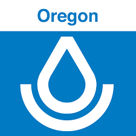

Funding Sources
===============
Work on Stand Mapping is led by David Diaz as part of his Ph.D research at
the University of Washington's `School of Environmental and Forest Sciences <https://sefs.uw.edu/>`_
and as Director of Forestry Technology & Analytics for the nonprofit organization
`Ecotrust <http://www.ecotrust.org>`_.

This work has been enabled by financial support from:

- `The Center for Sustainable Forestry at Pack Forest <http://www.packforest.org/>`_
- `NRCS Oregon <https://www.nrcs.usda.gov/wps/portal/nrcs/site/or/home/>`_ FY2017 and FY2019 Conservation Innovation Grants
- `USDA Western SARE <https://western.sare.org/>`_ Research & Education Grant
- Edwin W. and Catherine M. Davis Foundation

The Western SARE Research & Education Project is a collaborative effort co-led
by `Ecotrust <http://www.ecotrust.org>`_, `Wallowa Resources <https://www.wallowaresources.org/>`_,
`Northwest Natural Resource Group <https://www.nnrg.org/>`_, and the
`University of Washington <https://sefs.uw.edu/>`_. Find out more about the
project :doc:`here<sare-project>`.

.. image:: images/SARE_Western_CMYK.gif
   :width: 100
   :alt: Western SARE

.. image:: images/nifa-color-lockup-4x.png
   :width: 400
   :alt: USDA National Institute of Food and Agriculture

::

  """
  This material is based upon work that is supported by the National Institute
  of Food and Agriculture, U.S. Department of Agriculture, under award number
  G353-20-W7899 through the Western Sustainable Agriculture Research and
  Education program under project number SW20-914. USDA is an equal opportunity
  employer and service provider. Any opinions, findings, conclusions, or
  recommendations expressed in this publication are those of the author(s) and
  do not necessarily reflect the view of the U.S. Department of Agriculture.
  """
